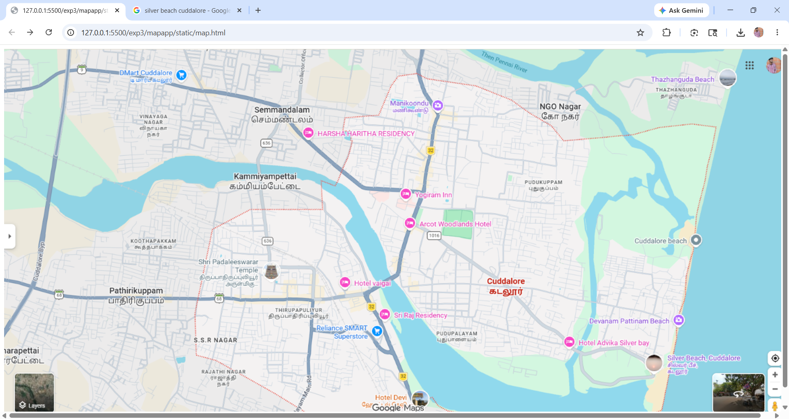
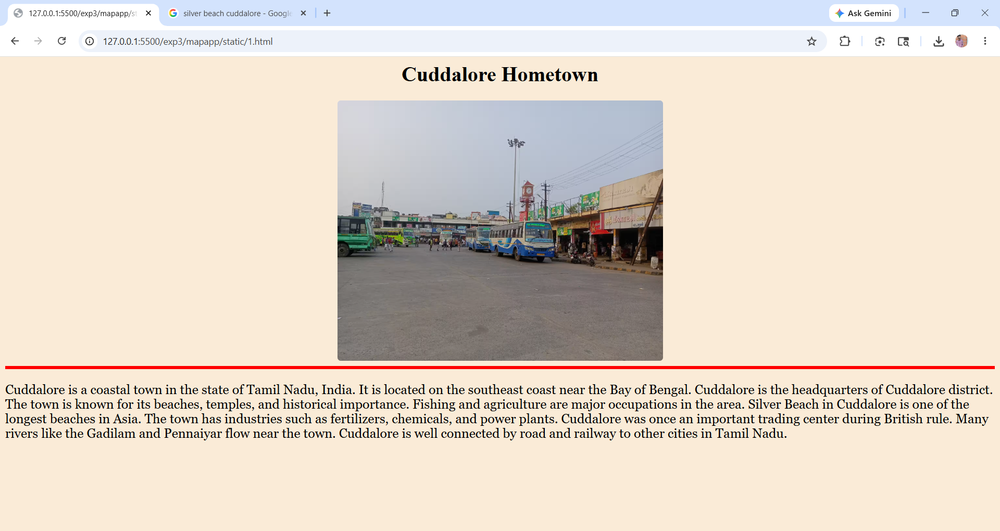
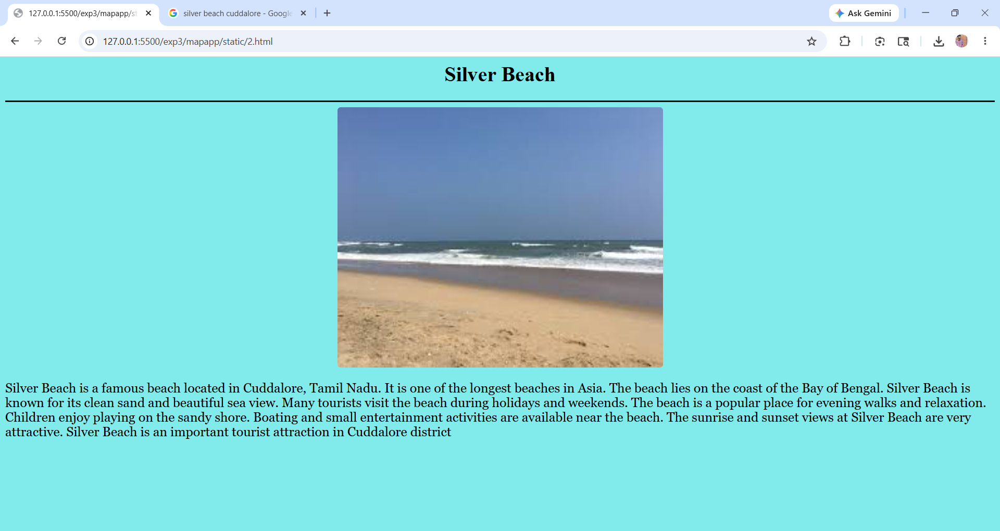
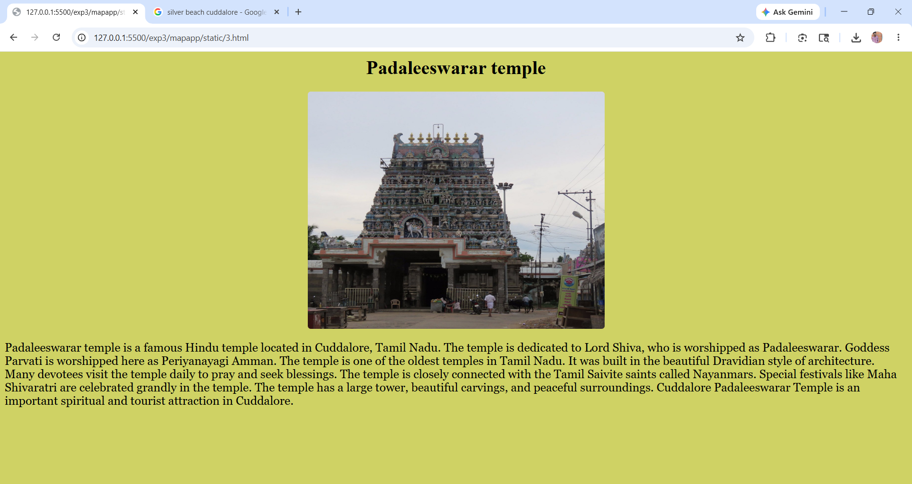
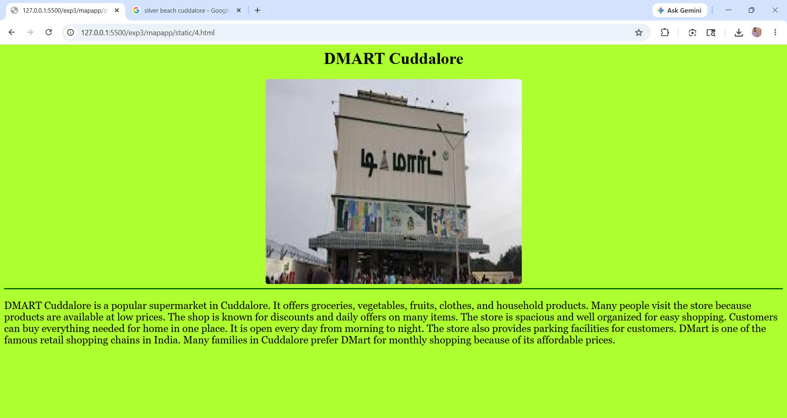
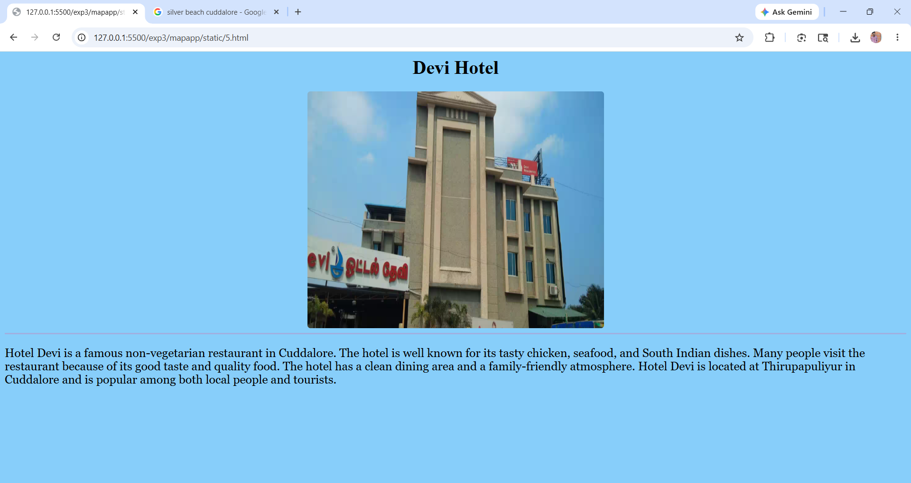

# Ex03 Places Around Me
## Date: 21.05.2026

## AIM
To develop a website to display details about the places around my house.

## DESIGN STEPS

### STEP 1
Create a Django admin interface.

### STEP 2
Download your city map from Google.

### STEP 3
Using ```<map>``` tag name the map.

### STEP 4
Create clickable regions in the image using ```<area>``` tag.

### STEP 5
Write HTML programs for all the regions identified.

### STEP 6
Execute the programs and publish them.

## CODE
```
map.html


            <map name="image-map">
            <area target="" alt=" CUDDALORE HOMETOWN" title="CUDDALORE HOMETOWN " href="1.html" coords="974,470,41" shape="circle">
            <area target="" alt="SILVER BEACH" title="SILVER BEACH" href="2.html" coords="1246,578,1326,660" shape="rect">
            <area target="" alt="TEMPLE" title="TEMPLE" href="3.html" coords="516,431,49" shape="circle">
            <area target="" alt="DMART" title="DMART" href="4.html" coords="309,25,382,90" shape="rect">
            <area target="" alt="DEVI HOTEL" title="DEVI HOTEL" href="5.html" coords="807,679,44" shape="circle">
            </map>


1.html

<html>
    <head>
        <h1><center>Cuddalore Hometown</center></h1>
        <style>
            p{
                font-size:20px;
                font-family: Georgia, 'Times New Roman', Times, serif;
            }
            img
            {
                width: 500px;
                height:400px;
                display:block;
                margin-left:auto;
                margin-right:auto;
                border-radius: 5px;
                
            }
            body{
                background-color: antiquewhite;
            }
           

        </style>
    </head>
    <body>
       
        
         <hr color="red" size="5">
        <p >            Cuddalore is a coastal town in the state of Tamil Nadu, India.
            It is located on the southeast coast near the Bay of Bengal.
            Cuddalore is the headquarters of Cuddalore district.
            The town is known for its beaches, temples, and historical importance.
            Fishing and agriculture are major occupations in the area.
            Silver Beach in Cuddalore is one of the longest beaches in Asia.
            The town has industries such as fertilizers, chemicals, and power plants.
            Cuddalore was once an important trading center during British rule.
            Many rivers like the Gadilam and Pennaiyar flow near the town.
            Cuddalore is well connected by road and railway to other cities in Tamil Nadu.</p>

    </body>
</html>

2.html

<html>
    <head>
        <h1><center>Silver Beach</center></h1>
        <hr color="black" size="3">
        <style>
            p{
                font-size:20px;
                font-family: Georgia, 'Times New Roman', Times, serif;
            }
            img
            {
                width: 500px;
                height:400px;
                display:block;
                margin-left:auto;
                margin-right:auto;
                border-radius: 5px;
                
            }
            body{
                background-color:rgb(129, 234, 234);
            }
        </style>
    </head>
    <body>
        
        <p>            Silver Beach is a famous beach located in Cuddalore, Tamil Nadu.
            It is one of the longest beaches in Asia.
            The beach lies on the coast of the Bay of Bengal.
            Silver Beach is known for its clean sand and beautiful sea view.
            Many tourists visit the beach during holidays and weekends.
            The beach is a popular place for evening walks and relaxation.
            Children enjoy playing on the sandy shore.
            Boating and small entertainment activities are available near the beach.
            The sunrise and sunset views at Silver Beach are very attractive.
            Silver Beach is an important tourist attraction in Cuddalore district</p>
    </body>
</html>

3.html

<html>
    <head>
        <h1><center>Padaleeswarar temple</center></h1>
        <style>
            p{
                font-size:20px;
                font-family: Georgia, 'Times New Roman', Times, serif;
            }
            img
            {
                width: 500px;
                height:400px;
                display:block;
                margin-left:auto;
                margin-right:auto;
                border-radius: 5px;
                
            }
            body{
                background-color:rgb(207, 210, 100);
            }
           
               
                
        </style>
        <body>
            
            <p>      Padaleeswarar temple is a famous Hindu temple located in Cuddalore, Tamil Nadu.
            The temple is dedicated to Lord Shiva, who is worshipped as Padaleeswarar.
            Goddess Parvati is worshipped here as Periyanayagi Amman.
            The temple is one of the oldest temples in Tamil Nadu.
            It was built in the beautiful Dravidian style of architecture.
            Many devotees visit the temple daily to pray and seek blessings.
            The temple is closely connected with the Tamil Saivite saints called Nayanmars.
            Special festivals like Maha Shivaratri are celebrated grandly in the temple.
            The temple has a large tower, beautiful carvings, and peaceful surroundings.
            Cuddalore Padaleeswarar Temple is an important spiritual and tourist attraction in Cuddalore.</p>
            
        </body>
    </head>
</html>

4.html

<html>
    <head>
        <h1><center>DMART Cuddalore</center></h1>
        <style>
            p{
                font-size:20px;
                font-family: Georgia, 'Times New Roman', Times, serif;
            }
            img
            {
                width: 500px;
                height:400px;
                display:block;
                margin-left:auto;
                margin-right:auto;
                border-radius: 5px;
                
            }
            body{
                background-color:greenyellow;
            }
        </style>

    </head>
    <body>
        
        <hr color="darkgreen" size="3">
    </body>
    <p>        DMART Cuddalore is a popular supermarket in Cuddalore.
     It offers groceries, vegetables, fruits, clothes, and household products.
     Many people visit the store because products are available at low prices.
     The shop is known for discounts and daily offers on many items.
     The store is spacious and well organized for easy shopping.
     Customers can buy everything needed for home in one place.
     It is open every day from morning to night.
     The store also provides parking facilities for customers.
     DMart is one of the famous retail shopping chains in India.
     Many families in Cuddalore prefer DMart for monthly shopping because of its affordable prices.</p>
</html>

5.html

<html>
    <head>
        <h1><center>Devi Hotel</center></h1>
        <style>
            p{
                font-size:20px;
                font-family: Georgia, 'Times New Roman', Times, serif;
            }
            img
            {
                width: 500px;
                height:400px;
                display:block;
                margin-left:auto;
                margin-right:auto;
                border-radius: 5px;
                
            }
            body{
                background-color:lightskyblue;
            }
        </style>

    </head>
    <body>
        
        <hr color="navyblue" size="3">
        <p>
            Hotel Devi is a famous non-vegetarian restaurant in Cuddalore.
            The hotel is well known for its tasty chicken, seafood, and South Indian dishes.
            Many people visit the restaurant because of its good taste and quality food.
            The hotel has a clean dining area and a family-friendly atmosphere.
            Hotel Devi is located at Thirupapuliyur in Cuddalore and is popular among both local people and tourists.
        </p>
    </body>
</html> 
```

## OUTPUT







## RESULT
The program for implementing image maps using HTML is executed successfully.
